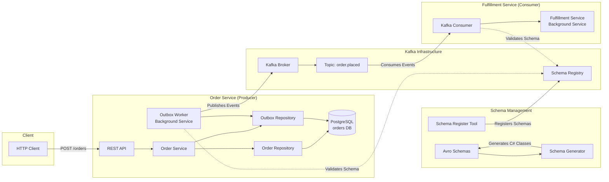

# Kafkaesque

Repository for learning Kafka, event streaming and event-driven architectural patterns.

## Architecture



**Key Components:**
- **Order Service**: REST API that creates orders and stores them in PostgreSQL with an outbox pattern for reliable event publishing
- **Outbox Worker**: Background service that polls the outbox table and publishes events to Kafka
- **Kafka Infrastructure**: Message broker with Schema Registry for Avro schema validation
- **Fulfillment Service**: Background consumer that processes order events from Kafka
- **Schema Management**: Avro schemas for type-safe event serialization/deserialization


## Getting Started

### Prerequisites
- Docker and Docker Compose
- .NET (with tools installed via `dotnet tool restore`)

### Running services
- Run the following bash script to start up the infrastructure:
   ```bash
   ./run.sh
   ```
- When making changes, we can rebuild and run a specific container by supplying it as an argument to the run script
   ```bash
   ./run.sh order-service # fulfillment-service, schema-register etc
   ```

### Creating topics
Currently the topics aren't created automatically when first starting the the Kafka instance (TODO). Instead we need to create these manually through the control center
- Open http://localhost:9021 to view the Kafka control center
- Navigate to the cluster and then to the topic
- Create a new topic `order.placed` with required partitions (3 is likely a sensible default)
- Restart the consumer containers

### Updating schemas
See the following guidance for [creating or updating schemas](./Schemas/README.md) 