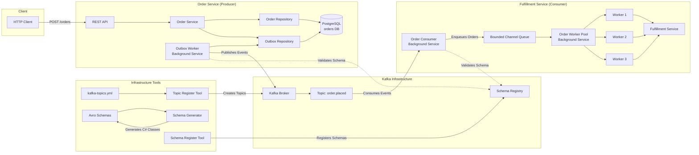

# Kafkaesque

Repository for learning Kafka, event streaming and event-driven architectural patterns.

## Architecture



**Key Components:**
- **Order Service**: REST API that creates orders and stores them in PostgreSQL with an outbox pattern for reliable event publishing
- **Outbox Worker**: Background service that polls the outbox table and publishes events to Kafka
- **Kafka Infrastructure**: Message broker with Schema Registry for Avro schema validation
- **Fulfillment Service**: Consumer service that processes order events from Kafka using a worker pool pattern
  - **Order Consumer**: Consumes events from Kafka and maps them to domain models
  - **Order Worker Pool**: Manages a bounded queue and configurable worker threads for concurrent order processing
  - **Fulfillment Service**: Processes individual orders (simulates fulfillment with random delays)
- **Infrastructure Tools**: 
  - **Topic Register**: Automatically registers Kafka topics from configuration on startup
  - **Schema Register**: Registers Avro schemas with the Schema Registry
  - **Schema Generator**: Generates C# classes from Avro schema definitions


## Getting Started

### Prerequisites
- Docker and Docker Compose
- .NET (with tools installed via `dotnet tool restore`)

### Running services
- Run the following bash script to start up the infrastructure:
   ```bash
   ./run.sh
   ```
- When making changes, we can rebuild and run a specific container by supplying it as an argument to the run script
   ```bash
   ./run.sh order-service # fulfillment-service, schema-register, topic-register etc
   ```

### Managing topics
Topics are automatically created on startup via the `topic-register` service, which reads from [kafka-topics.yml](Schemas/kafka-topics.yml).

**Adding new topics:**
1. Edit [kafka-topics.yml](Schemas/kafka-topics.yml) to add your topic definition
2. Restart the infrastructure: `./run.sh`

Topics can also be managed manually through the Kafka Control Center at http://localhost:9021.

### Viewing logs
Structured logs from services are sent to Seq in development mode. Access the Seq web UI at http://localhost:5341 to search, filter, and analyze logs.

### Updating schemas
See the following guidance for [creating or updating schemas](./Schemas/README.md) 