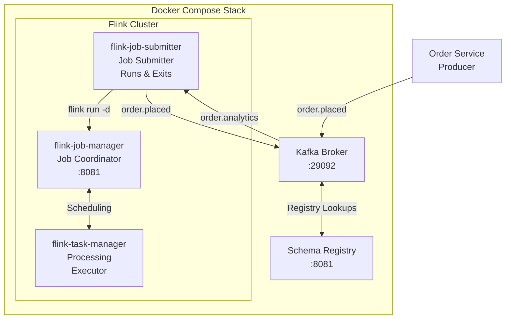
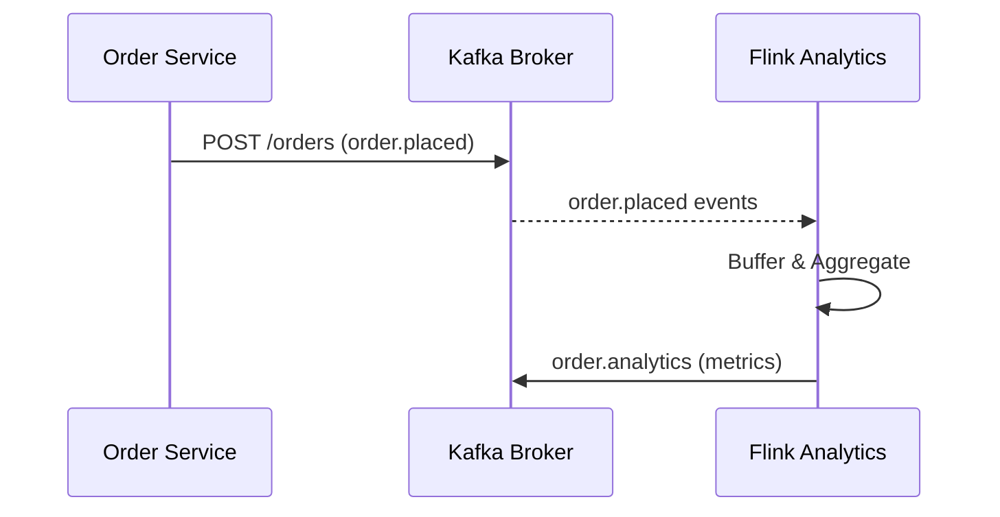

# Flink Job Submitter

Generic container for submitting Flink jobs to the cluster. Supports multiple job JARs via build args.

## Architecture Overview



## Container Roles

### flink-job-submitter
- **Role**: Job submitter (run once, then exit)
- **Responsibilities**:
  - Contains the Flink job JAR built by Maven
  - On startup, runs `flink run` to submit the job to the JobManager
  - Container exits after submission (this is expected)
  - Actual processing happens on the Flink cluster
- **Lifecycle**: Short-lived, analogous to a migration script

## Multi-Job Support

This container can submit multiple different Flink jobs by building different JARs. The `FLINK_JOB_JAR` build arg specifies the JAR filename.

**Note**: Each job requires its own module with a `pom.xml` and source code. This directory contains the `flink-job-submitter` module which builds `flink-job-submitter-1.0.0-SNAPSHOT.jar`.

## Processing Pipeline

### Data Flow



### Job Components

1. **KafkaSource** (`MainAnalyticsJob.java:89-95`)
   - Reads from `order.placed` topic
   - Uses Confluent Avro deserialization
   - Group ID: `flink-analytics-consumer-v2`

2. **ProcessFunction** (`MainAnalyticsJob.java:135-186`)
   - Buffer incoming orders
   - Emit metrics every 10 orders
   - Calculate: count, total items, average order value

3. **KafkaSink** (`MainAnalyticsJob.java:108-114`)
   - Writes to `order.analytics` topic
   - Uses Confluent Avro serialization

## Checkpointing & Fault Tolerance

Flink uses checkpointing for exactly-once processing:

- **Interval**: Every 60 seconds
- **What's checkpointed**:
  - Kafka consumer offset (resumes from last processed event)
  - Operator state (window buffers)
- **On failure**: Job restarts from last checkpoint

## Running Locally

### Build

The Docker build requires the JAR to be built locally first. This approach ensures consistent, reproducible builds without relying on external build environments within the container.

```bash
cd flink-job-submitter
mvn clean package -DskipTests
```

### Run Job (via Docker)

```bash
# From repository root
./run.sh flink-job-submitter

# Or via docker-compose directly
docker-compose up -d --build flink-job-submitter
```

### Build Specific Job

```bash
mvn package -DskipTests
./run.sh flink-job-submitter
```

### Build Process

1. **Maven builds the JAR**: `mvn package` creates the shaded JAR in `target/flink-job-submitter-1.0.0-SNAPSHOT.jar`
2. **Docker copies the JAR**: The Dockerfile copies the pre-built JAR into the Flink base image
3. **Container submits job**: On startup, the container runs `flink run` to submit the job and exits

## Monitoring

- **Flink Web UI**: http://localhost:8084
  - Job status, metrics, checkpoints
- **Kafka topics**: http://localhost:9021 (Kafka Control Center)
- **Container logs**: `docker logs flink-task-manager`

## Configuration

Key settings in `application.properties`:

| Property | Description | Default |
|----------|-------------|---------|
| `kafka.bootstrap.servers` | Kafka broker address | `broker:29092` |
| `kafka.schema.registry.url` | Schema Registry URL | `http://schema-registry:8081` |
| `flink.source.topic` | Input topic | `order.placed` |
| `flink.sink.topic` | Output topic | `order.analytics` |
| `flink.checkpoint.interval` | Checkpoint frequency | `60000ms` |